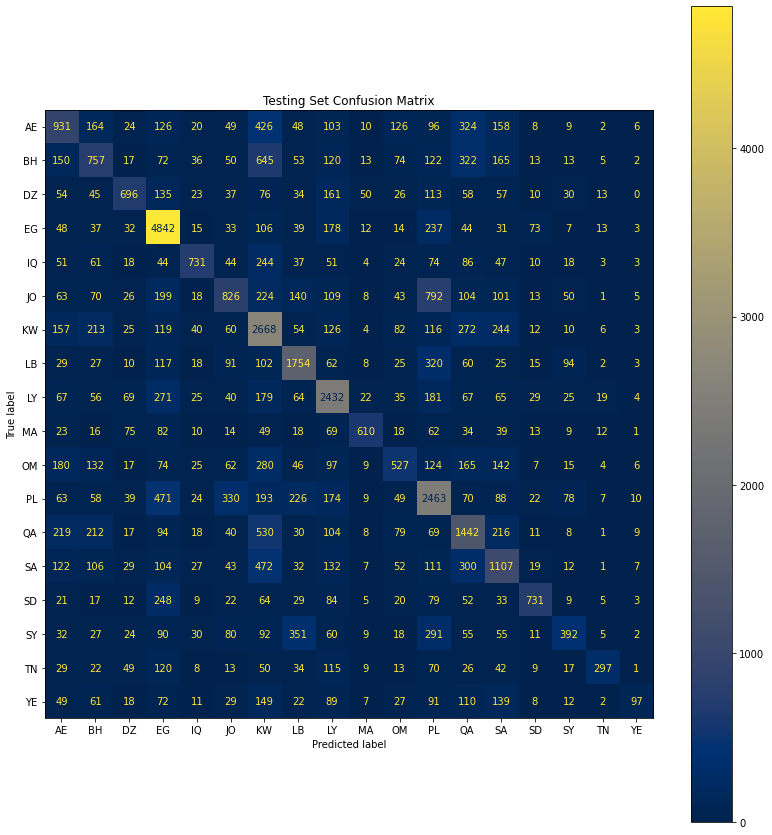
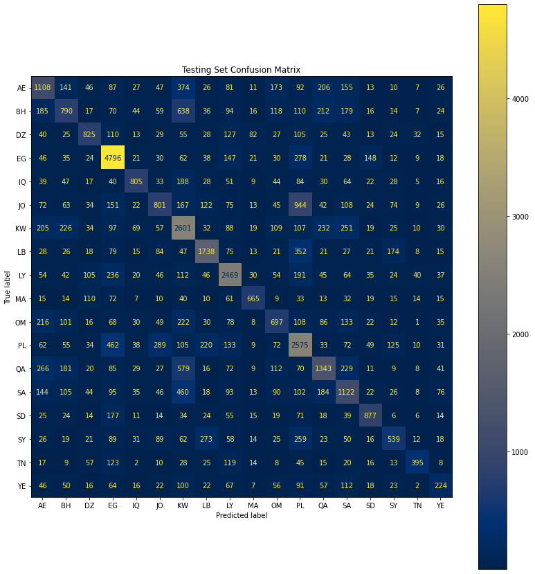

# Arabic Dialect Identification

## Introduction
Many countries speak Arabic; however, each country has its own dialect, the aim of this project is to
build a model that predicts the dialect given the text.

## Environment setup
```
# using pip
pip install -r requirements.txt

# using Conda
conda create --name <env_name> --file requirements.txt
```

## Method
### Machine learning

-  Start by fetching the text data from API using `fetch_data.py` script.
```
python fetch_data.py
```

- **Exploratory Data Analysis:** you can see the EDA steps in [EDA_notebook.ipynb](EDA_notebook.ipynb).

- **Preprocessing:** 
  
    1- Text Normalization: Done using ArabicTextNormalizer, found in [preprocessing.py](preprocessing.py#L9)
    
    2- Victorization using Tf-Idf vectorizer with ngram_range = (1,5) and min_df = 10.

    3- Split the dataset into training, validation, and testing splits with (8:1:1) ratio.

    - Note: Other methods were tested for Preprocessing, you can see it in [preprocessing.py](preprocessing.py).

- **Training:** For a machine learning approach, Logistic Regression model is used. you can train the model using `trainer.py` script. For more details about the training process you can see [training_notebook.ipynb](training_notebook.ipynb)
    
    - Classification Report on test data:

        |     Dialect    | precision | recall |  f1-score  | support |
        |----------------|-----------|--------|------------|---------|
        |       AE       |  0.4283   | 0.3802 |   0.4028   |  2630   |
        |       BH       |  0.3661   | 0.2864 |   0.3214   |  2629   |
        |       DZ       |  0.5851   | 0.4376 |   0.5007   |  1618   |
        |       EG       |  0.6504   | 0.8522 |   0.7378   |  5764   |
        |       IQ       |  0.6775   | 0.4987 |   0.5745   |  1550   |
        |       JO       |  0.4379   | 0.3044 |   0.3592   |  2792   |
        |       KW       |  0.4177   | 0.6037 |   0.4938   |  4211   |
        |       LB       |  0.6045   | 0.6459 |   0.6245   |  2762   |
        |       LY       |  0.5952   | 0.6797 |   0.6347   |  3650   |
        |       MA       |  0.7735   | 0.5208 |   0.6225   |  1154   |
        |       OM       |  0.4402   | 0.2965 |   0.3544   |  1912   |
        |       PL       |  0.4358   | 0.5649 |   0.4920   |  4374   |
        |       QA       |  0.4537   | 0.4641 |   0.4589   |  3107   |
        |       SA       |  0.3917   | 0.4372 |   0.4132   |  2683   |
        |       SD       |  0.7652   | 0.5239 |   0.6220   |  1443   |
        |       SY       |  0.5165   | 0.2691 |   0.3538   |  1624   |
        |       TN       |  0.7488   | 0.3323 |   0.4603   |   924   |
        |       YE       |  0.5482   | 0.1259 |   0.2048   |   993   |
        |  **accuracy**  |     -     |    -   |   0.5168   |  45820  |
        | **macro avg**  |  0.5465   | 0.4569 |   0.4795   |  45820  |
        |**weighted avg**|  0.5225   | 0.5168 |   0.5055   |  45820  |

    - Confusion matrix for test data:
    

- **Predictions:** You can easily get predictions for any text using the available API. To get it started, run `run.sh` or type `uvicorn api:app` in the terminal and call the API by a **POST** request to *127.0.0.1:8000/predict*.
    
    - Request body sample:
```json
{
    "text": "متهيالي دي شكولاته الهالوين فين المحل ده"
}
```
  - Response sample:
```json
{
  "text": "متهيالي دي شكولاته الهالوين فين المحل ده",
  "predictions": {
    "AE": 0,
    "BH": 0,
    "DZ": 0.001,
    "EG": 0.98,
    "IQ": 0,
    "JO": 0,
    "KW": 0,
    "LB": 0,
    "LY": 0,
    "MA": 0.002,
    "OM": 0,
    "PL": 0.003,
    "QA": 0,
    "SA": 0,
    "SD": 0.007,
    "SY": 0,
    "TN": 0.005,
    "YE": 0
  }
}
```
  - If you want to predict the dialect of a patch of texts, call the API by a **POST** request to *127.0.0.1:8000/predict-batch*
     - Request body sample:
```json
{
  "texts": [
    "متهيالي دي شكولاته الهالوين فين المحل ده",
    "شلونك خوي؟"
  ]
}
```

- Response sample:

```json
{
  "predictions": [
    {
      "text": "متهيالي دي شكولاته الهالوين فين المحل ده",
      "predictions": {
        "AE": 0,
        "BH": 0,
        "DZ": 0.001,
        "EG": 0.98,
        "IQ": 0,
        "JO": 0,
        "KW": 0,
        "LB": 0,
        "LY": 0,
        "MA": 0.002,
        "OM": 0,
        "PL": 0.003,
        "QA": 0,
        "SA": 0,
        "SD": 0.007,
        "SY": 0,
        "TN": 0.005,
        "YE": 0
      }
    },
    {
      "text": "شلونك خوي؟",
      "predictions": {
        "AE": 0.012,
        "BH": 0.199,
        "DZ": 0.004,
        "EG": 0.006,
        "IQ": 0.098,
        "JO": 0.018,
        "KW": 0.112,
        "LB": 0.006,
        "LY": 0.48,
        "MA": 0.004,
        "OM": 0.015,
        "PL": 0.007,
        "QA": 0.008,
        "SA": 0.007,
        "SD": 0.005,
        "SY": 0.008,
        "TN": 0.004,
        "YE": 0.007
      }
    }
  ]
}
```
  - To get the status of the model contained in the API, make a **GET** request to *127.0.0.1:8000/status*
    - If a trained model is available, the response should look like this:
```json
{
  "status": "Model Ready",
  "timestamp": "2022-03-13T13:14:45.789941",
  "classes": [
    "AE",
    "BH",
    "DZ",
    "EG",
    "IQ",
    "JO",
    "KW",
    "LB",
    "LY",
    "MA",
    "OM",
    "PL",
    "QA",
    "SA",
    "SD",
    "SY",
    "TN",
    "YE"
  ],
  "evaluation": {
    "AE": {
      "precision": 0.4282655246252677,
      "recall": 0.38022813688212925,
      "f1-score": 0.40281973816717015,
      "support": 2630
    },
    "BH": {
      "precision": 0.3660670879922217,
      "recall": 0.28642069227843286,
      "f1-score": 0.3213828425096031,
      "support": 2629
    },
    "DZ": {
      "precision": 0.5851239669421487,
      "recall": 0.43757725587144625,
      "f1-score": 0.5007072135785007,
      "support": 1618
    },
    "EG": {
      "precision": 0.6504237288135594,
      "recall": 0.8521859819569744,
      "f1-score": 0.7377590868128568,
      "support": 5764
    },
    "IQ": {
      "precision": 0.677475898334794,
      "recall": 0.49870967741935485,
      "f1-score": 0.5745076179858789,
      "support": 1550
    },
    "JO": {
      "precision": 0.43791859866048427,
      "recall": 0.3044412607449857,
      "f1-score": 0.3591802239594338,
      "support": 2792
    },
    "KW": {
      "precision": 0.41774856203779787,
      "recall": 0.603657088577535,
      "f1-score": 0.49378399378399374,
      "support": 4211
    },
    "LB": {
      "precision": 0.6045408336157235,
      "recall": 0.6459087617668356,
      "f1-score": 0.624540521617364,
      "support": 2762
    },
    "LY": {
      "precision": 0.5952495201535508,
      "recall": 0.6797260273972603,
      "f1-score": 0.634689178818112,
      "support": 3650
    },
    "MA": {
      "precision": 0.7734877734877735,
      "recall": 0.5207972270363952,
      "f1-score": 0.6224754013464527,
      "support": 1154
    },
    "OM": {
      "precision": 0.44021739130434784,
      "recall": 0.2965481171548117,
      "f1-score": 0.354375,
      "support": 1912
    },
    "PL": {
      "precision": 0.43580246913580245,
      "recall": 0.5649291266575217,
      "f1-score": 0.49203504579848667,
      "support": 4374
    },
    "QA": {
      "precision": 0.45374449339207046,
      "recall": 0.4641132925651754,
      "f1-score": 0.45887032617342877,
      "support": 3107
    },
    "SA": {
      "precision": 0.391652754590985,
      "recall": 0.4371971673499814,
      "f1-score": 0.41317365269461076,
      "support": 2683
    },
    "SD": {
      "precision": 0.7651821862348178,
      "recall": 0.5239085239085239,
      "f1-score": 0.6219662690250926,
      "support": 1443
    },
    "SY": {
      "precision": 0.516548463356974,
      "recall": 0.26908866995073893,
      "f1-score": 0.3538461538461538,
      "support": 1624
    },
    "TN": {
      "precision": 0.748780487804878,
      "recall": 0.33225108225108224,
      "f1-score": 0.46026986506746626,
      "support": 924
    },
    "YE": {
      "precision": 0.5482456140350878,
      "recall": 0.12588116817724068,
      "f1-score": 0.20475020475020475,
      "support": 993
    },
    "accuracy": 0.5168485377564382,
    "macro avg": {
      "precision": 0.5464708530287936,
      "recall": 0.4568649587748014,
      "f1-score": 0.47950735199637834,
      "support": 45820
    },
    "weighted avg": {
      "precision": 0.522461860325834,
      "recall": 0.5168485377564382,
      "f1-score": 0.5055483538291743,
      "support": 45820
    }
  }
}
```
  - To train the model on a new dataset, call the API by a **POST** request to *127.0.0.1:8000/train*
    - Request body sample:
```json
{
  "texts": [
    "text1",
    "text2"
  ],
  "labels": [
    "label1",
    "label2"
  ]
```

### Deep learning
  - **Preprocessing:** 
    
      1- Text Normalization: Done using ArabicTextNormalizer, found in [preprocessing.py](preprocessing.py#L9)
      
      2- Tokenization and padding: Used Tokeniner with num_words=100000 and max. sequence length of 50.

      3- Split the dataset into training, validation, and testing splits with (8:1:1) ratio.

      - Note: Other methods were tested for Preprocessing, you can see it in [preprocessing.py](preprocessing.py).

  - **Model Structure:** 
      - Embedding layer with dim = 100.
      - LSTM layer with 100 nodes.
      - Dense layer with 18 nodes and softmax activation function.

    |   Layer(type)  |  Output Shape |   Param #  |
    |----------------|---------------|------------|
    |   Embedding    |(None, 50, 100)| 10,000,000 |
    |SpatialDropout1D|(None, 50, 100)|     0      |
    |      LSTM      |  (None, 100)  |   80,4000  |
    |      Dense     |   (None, 18)  |    1,818   |

  - Classification Report on test data:

    |     Dialect    | precision | recall |  f1-score  | support |
    |----------------|-----------|--------|------------|---------|
    |       AE       |  0.4324   | 0.4388 |   0.4356   |  2630   |
    |       BH       |  0.3812   | 0.3203 |   0.3481   |  2629   |
    |       DZ       |  0.5576   | 0.5173 |   0.5367   |  1618   |
    |       EG       |  0.6837   | 0.8525 |   0.7589   |  5764   |
    |       IQ       |  0.6653   | 0.5232 |   0.5858   |  1550   |
    |       JO       |  0.4855   | 0.3177 |   0.3841   |  2792   |
    |       KW       |  0.4910   | 0.5526 |   0.5200   |  4211   |
    |       LB       |  0.5856   | 0.6883 |   0.6328   |  2762   |
    |       LY       |  0.6156   | 0.6964 |   0.6536   |  3650   |
    |       MA       |  0.7016   | 0.5971 |   0.6451   |  1154   |
    |       OM       |  0.4052   | 0.3766 |   0.3903   |  1912   |
    |       PL       |  0.4977   | 0.5103 |   0.5039   |  4374   |
    |       QA       |  0.4826   | 0.4718 |   0.4771   |  3107   |
    |       SA       |  0.3698   | 0.4562 |   0.4085   |  2683   |
    |       SD       |  0.7183   | 0.5495 |   0.6227   |  1443   |
    |       SY       |  0.4397   | 0.3436 |   0.3858   |  1624   |
    |       TN       |  0.6237   | 0.4665 |   0.5337   |   924   |
    |       YE       |  0.3995   | 0.1762 |   0.2446   |   993   |
    |  **accuracy**  |     -     |    -   |   0.5348   |  45820  |
    | **macro avg**  |  0.5298   | 0.4919 |   0.5037   |  45820  |
    |**weighted avg**|  0.5299   | 0.5348 |   0.5269   |  45820  |

    - Confusion matrix for test data:
    